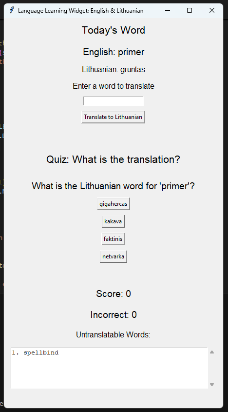
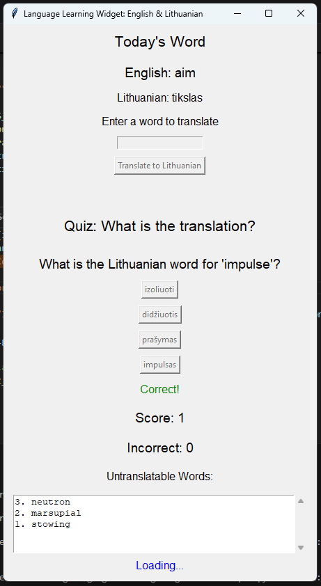

# Language Learning Widget: English & Lithuanian

A simple Tkinter-based application designed to help users learn Lithuanian vocabulary through word translation and quiz-style questions.

## Features

- **Daily Word Display**: Displays a random English word and its Lithuanian translation.
- **Translation Tool**: Enter an English word to see its Lithuanian translation.
- **Quiz Section**: Test your knowledge with multiple-choice questions on Lithuanian translations.
- **Untranslatable Words Tracker**: Keeps track of words that could not be translated, displayed with a scrollbar.

## Screenshots




## Requirements

- Python 3.x
- Tkinter
- Requests library

You can install the required library using:

```bash
pip install requests
```

## Getting Started

1. **Clone the repository**:
   ```bash
   git clone https://github.com/RenaldasZ/language-learning-widget.git
   cd language-learning-widget
   ```

2. **Create a `.env` file in the root of the project directory with the following content**:

   ```bash
   YANDEX_API_KEY=your-api-key-here
   ```
   Replace your-api-key-here with a valid API key from the Yandex Dictionary API.

3. **Run the application**:
   ```bash
   python main.py
   ```

## Usage

- On startup, the widget will display today's English word and its translation.
- Enter any English word in the input box and click "Translate to Lithuanian" to see its translation.
- Participate in the quiz to test your knowledge by selecting the correct Lithuanian translation from the provided options.

## Project Structure

```
language-learning-widget/
│
├── main.py                     # Main application script
├── README.md                   # Project documentation
└── .env                        # Environment variables configuration
```

## Author

Renaldas  
[RenaldasZ](https://github.com/RenaldasZ)

## License

This project is licensed under the MIT License - see the [LICENSE](LICENSE) file for details.
